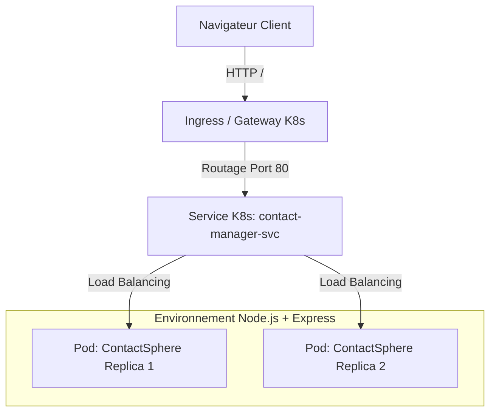

# ContactSphere — Application de Gestion de Contacts avec React, Tailwind et Kubernetes

ContactSphere est une application moderne et élégante pour gérer ses contacts, écrite avec React pour le frontend, Express pour le backend, packagée avec **Docker** et déployée sur **Kubernetes**. Le système est conçu comme un service unique accessible via une passerelle d'accès (Gateway / Ingress).

## Architecture du Projet

L'application est structurée de manière simple et modulaire :



## Prérequis

Pour exécuter et tester ce projet sur macOS, vous aurez besoin de :

1. **Node.js** (v18+) et npm.
2. **Docker** (Docker Desktop ou Colima).
3. **Homebrew** (gestionnaire de paquets pour macOS).
4. **Minikube** (pour exécuter un cluster Kubernetes localement).
5. **kubectl** (l'outil CLI pour interagir avec le cluster).

### Installation des outils via Homebrew

Exécutez les commandes suivantes dans votre terminal :

```bash
# Installation de kubectl
brew install kubectl

# Installation de Minikube
brew install minikube
```

## Développement local (sans Kubernetes)

L'application utilise un serveur Express pour l'API backend et un serveur Vite pour l'application React.

### Installation des dépendances (Racine + Frontend)
```bash
npm run install:all
```

### Lancement en mode développement
Pour développer localement avec un rechargement à chaud (Hot Module Replacement) :

1. **Lancer le serveur backend** (écoute sur le port `3000`) :
   ```bash
   npm run dev:backend
   ```

2. **Lancer le serveur frontend Vite** (dans un autre terminal, écoute sur le port `5173`) :
   ```bash
   npm run dev:frontend
   ```
   *Note : Le serveur Vite est configuré pour rediriger automatiquement les requêtes `/api/*` vers le backend Express.*

Accédez ensuite à : **[http://localhost:5173](http://localhost:5173)**.

### Build de production local
Pour compiler le frontend et le backend en un ensemble prêt à l'emploi :
```bash
npm run build
npm start
```
Le serveur Express assemblé écoutera sur le port `3000` et servira les fichiers statiques de React depuis le dossier `frontend/dist`.

---

## Création de l'image Docker

L'application est configurée avec un `Dockerfile` multi-stage pour garantir une image finale minimale et sécurisée en production.

### Lancer votre cluster Minikube
```bash
minikube start
```

### Configurer le terminal pour utiliser le démon Docker de Minikube
Pour éviter d'avoir à pousser l'image Docker sur un registre public (comme Docker Hub), nous configurons le terminal actuel pour construire l'image directement dans l'environnement Docker de Minikube :
```bash
eval $(minikube docker-env)
```
*(Note : Cette commande doit être exécutée dans chaque nouvelle fenêtre de terminal où vous construisez l'image).*

### Construire l'image Docker
```bash
docker build -t contact-manager:latest .
```

---

## Déploiement sur Kubernetes

Les fichiers de configuration se trouvent dans le dossier [k8s/](file:///Users/osbyrne/cloud/k8s).

### Déploiement de l'Application (Deployment & Service)

Exécutez la commande suivante pour déployer l'application et son service interne (ClusterIP) :
```bash
kubectl apply -f k8s/deployment.yaml
kubectl apply -f k8s/service.yaml
```

Vérifiez que les pods fonctionnent correctement :
```bash
kubectl get pods -w
```
*(Attendez que le statut de tous les pods passe à `Running`)*.

---

## Accès via la Gateway (Ingress ou Gateway API)

Pour rendre l'application accessible depuis l'extérieur du cluster via une gateway, vous avez deux options selon la configuration de votre cluster.

### Option A : Utilisation d'un Ingress Controller (Recommandé pour Minikube)

Minikube intègre un contrôleur Ingress NGINX facile à activer.

1. **Activer l'addon Ingress dans Minikube** :
   ```bash
   minikube addons enable ingress
   ```

2. **Appliquer la configuration de l'Ingress** :
   ```bash
   kubectl apply -f k8s/ingress.yaml
   ```

3. **Lancer le tunnel Minikube** (nécessaire sur macOS pour acheminer le trafic réseau vers le cluster) :
   ```bash
   minikube tunnel
   ```
   *(Gardez ce terminal ouvert)*.

4. **Accéder à l'application** :
   Ouvrez votre navigateur et accédez à l'adresse de votre passerelle locale :
   ```bash
   # Récupérer l'adresse IP de l'ingress
   kubectl get ingress
   ```
   Sur macOS avec minikube tunnel, l'Ingress sera accessible sur **[http://localhost](http://localhost)** ou via l'adresse IP affichée par la commande précédente.

### Option B : Utilisation de Kubernetes Gateway API (Standard Moderne)

Si votre cluster utilise la nouvelle spécification **Gateway API** (avec un contrôleur comme Envoy Gateway, Kong, ou Cilium) :

1. **Appliquer la Gateway et la HTTPRoute** :
   ```bash
   kubectl apply -f k8s/gateway.yaml
   ```

2. **Vérifier le statut de la Gateway** :
   ```bash
   kubectl get gateway
   ```

3. **Accéder à l'application** :
   Récupérez l'adresse IP externe de la Gateway et accédez-y dans votre navigateur.

---

## Commandes de Diagnostic et de Test

Voici quelques commandes utiles pour déboguer ou observer le déploiement :

* **Vérifier l'état de santé du service** :
  ```bash
  kubectl get svc contact-manager-svc
  ```
* **Consulter les logs en temps réel** :
  ```bash
  kubectl logs -l app=contact-manager -f
  ```
* **Simuler une panne (redémarrage des pods)** :
  ```bash
  kubectl rollout restart deployment contact-manager
  ```
* **Accéder au service directement sans Ingress (Port-Forward)** :
  ```bash
  kubectl port-forward svc/contact-manager-svc 8080:80
  ```
  Accédez ensuite à **[http://localhost:8080](http://localhost:8080)**.
